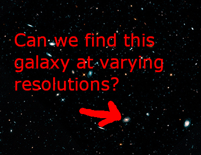

# Template Matching
> really looking for a perfect match between template and image
> no real ML; works well with minimal changes between template and input
> also due to max value, without logic won't find duplicate matches (multi-template matching)
> scale, rotation, viewpoint changes can result in low correlation, missed detection and/or false positive detection



This demonstrates using a hueristic over actual machine learning model
1. utilize image pyramids for multi-scale object detection
1. apply template matching at each layer

Explaining the image pyramid layers in python numpy array using linspace
- start at 0.2
- increment by constant factor
- 20 times
- until you reach 1.0
- then reverse it so you go original res increment down

```angular2html
In: import numpy as np
In: x = np.linspace(0.2, 1.0, 20)
In: x
Out[4]: 
array([0.2       , 0.24210526, 0.28421053, 0.32631579, 0.36842105,
       0.41052632, 0.45263158, 0.49473684, 0.53684211, 0.57894737,
       0.62105263, 0.66315789, 0.70526316, 0.74736842, 0.78947368,
       0.83157895, 0.87368421, 0.91578947, 0.95789474, 1.        ])
In: x[::1]
Out[5]: 
array([0.2       , 0.24210526, 0.28421053, 0.32631579, 0.36842105,
       0.41052632, 0.45263158, 0.49473684, 0.53684211, 0.57894737,
       0.62105263, 0.66315789, 0.70526316, 0.74736842, 0.78947368,
       0.83157895, 0.87368421, 0.91578947, 0.95789474, 1.        ])
```

how? 
- sliding window
- left>right
- top>bottom
- compute a score "normalized correlation coefficient"
    - how well did the pixels match between template and target

Use cases: 
> this that are in the same orientation and viewpoint

1. logos
1. signatures
1. telescope imagery
1. microscope imagery

If you find you want multi-instance and multi-scale, you likely need full object detection model...but maybe not.